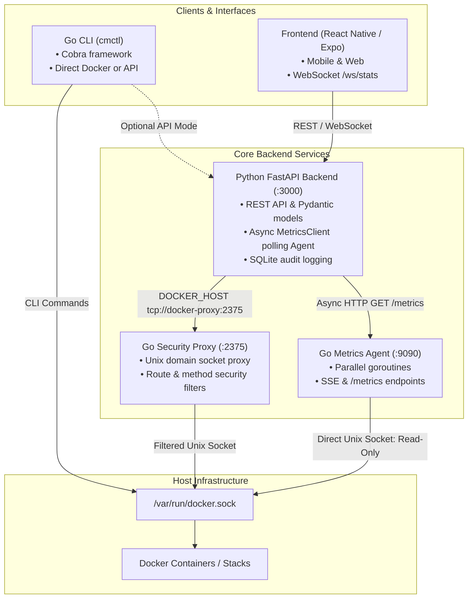

# ContainerMaster — Next Steps & Integration Roadmap

> **Local Document:** Ignored by Git (`.gitignore: /docs/*`).  
> **Last Updated:** September 2026  
> **Purpose:** Comprehensive, step-by-step master plan covering the Go ecosystem, Python backend, Docker orchestration, and frontend integration.

---

## 1. System Architecture & Component Mapping

---

## 2. Component Status Summary

| Component | Tech Stack | Status | Integration Notes |
| :--- | :--- | :---: | :--- |
| **Go CLI (`cli/cmctl`)** | Go 1.23, Cobra, Docker SDK | ✅ Completed | Commands: `version`, `status`, `ps`, `start`, `stop`, `logs`. Unit tests passing. |
| **Go Metrics Agent (`agent/`)** | Go 1.23, Docker SDK, SSE | ✅ Completed | Scrapes Docker stats concurrently via Goroutines/Channels. Port `9090`. Multi-stage Dockerfile ready. |
| **Go Security Proxy (`proxy/`)** | Go 1.23, `httputil.ReverseProxy` | ✅ Completed | Filters dangerous Docker socket calls. Port `2375`. Replaced 3rd-party proxy in Compose. |
| **Python Backend (`backend/`)** | FastAPI, Pydantic v2, SQLAlchemy | ✅ 60/60 Tests | `MetricsClient` integrated with Go Agent. `POST /api/system/prune` implemented. |
| **Docker Compose (`docker-compose.yml`)** | Compose v2 | ✅ Wired | Services: `docker-proxy`, `backend`, `metrics-agent`, `frontend-web`. |
| **Audit Trail (`AuditService`)** | SQLite / SQLAlchemy async | 🔄 In Progress | Logs lifecycle events. Needs real client IP extraction. |
| **Frontend Integration** | React Native, Expo, Web | ⏳ Next | Needs UI for Prune action, stack deployment, and live agent metrics view. |

---

## 3. Actionable Next Steps

### Phase 1: Backend Polish & Security (Python / FastAPI)
- [ ] **Enrich Audit Log with Real Client IP:**
  - Update `_container_action` and container endpoints in `backend/app/routers/containers.py` to accept `request: Request`.
  - Extract client IP using helper function checking `X-Forwarded-For` header, falling back to `request.client.host`.
  - Pass the resolved IP into `AuditService.log_action(..., client_ip=resolved_ip)`.
  - Update `test_metrics_and_audit_api.py` to assert IP extraction.
- [ ] **Add Unit Tests for Observability & Headers:**
  - Verify `X-Request-ID` is present on all API responses.
  - Verify `LOG_FORMAT=json` outputs valid JSON lines.

### Phase 2: CLI Expansion (`cli/cmctl` in Go)
- [ ] **Implement `cmctl prune` Subcommand:**
  - Create `cli/cmd/prune.go` using Cobra.
  - Flags:
    - `-a, --all`: Prune containers, images, volumes, and networks.
    - `--volumes`: Include volumes (default: false).
    - `--images`: Include images (default: true).
    - `--containers`: Include stopped containers (default: true).
    - `-y, --yes`: Bypass interactive confirmation prompt.
  - Connect via Docker Go SDK (`client.ContainersPrune`, `ImagesPrune`, etc.) or query `POST /api/system/prune`.
  - Pretty-print reclaimed disk space (human-readable MB/GB).
  - Add unit tests in `cli/cmd/prune_test.go`.

### Phase 3: End-to-End Verification (Docker Compose)
- [ ] **Full Multi-Service Build & Spin-up:**
  - Run `docker compose build` to ensure all 3 Go/Python Dockerfiles compile cleanly.
  - Spin up services: `docker compose up -d`.
  - Verify health and connectivity:
    - Proxy: `curl http://localhost:2375/_ping` -> `OK`
    - Agent: `curl http://localhost:9090/health` -> `{"status":"ok"}`
    - Backend: `curl http://localhost:3000/api/health` -> `{"status":"ok"}`
    - Telemetry flow: verify backend logs showing metrics gathered from `metrics-agent:9090`.
- [ ] **Security Proxy E2E Verification:**
  - Verify permitted endpoints succeed (e.g. `GET /containers/json`).
  - Verify blocked or restricted methods respond with 403 Forbidden.

### Phase 4: Frontend Integration (React Native / Web)
- [ ] **System Prune UI:**
  - Create a "Storage & Cleanup" modal or section in the System/Settings screen.
  - Toggles for: Stopped Containers, Dangling Images, Unused Volumes, Unused Networks.
  - Display confirmation modal with warning about volume deletion.
  - Call `POST /api/system/prune` and show a toast/alert with reclaimed disk space.
- [ ] **Real-time Telemetry Dashboard:**
  - Connect WebSocket `/ws/stats` to show live CPU & Memory graphs powered by Go Agent data.
- [ ] **Audit Trail Viewer:**
  - Add screen to inspect operational audit logs (`/api/audit-logs`) with user, action, IP, and timestamp.

---

## 4. Verification & Testing Checklist

- [x] Backend Unit Tests: 60/60 passing (`.venv/bin/pytest tests`)
- [x] Pyright / Pylance Type Check: 0 errors in `backend/app/services/docker_service.py`
- [x] Go CLI Unit Tests: Passing (`go test ./...` in `cli/`)
- [x] Go Proxy Unit Tests: Passing (`go test ./...` in `proxy/`)
- [x] Go Agent Build: Clean binary compilation (`go build main.go` in `agent/`)
- [ ] Audit Real IP Tests: Pending Phase 1
- [ ] `cmctl prune` Unit Tests: Pending Phase 2
- [ ] Full Docker Compose E2E Smoke Test: Pending Phase 3
